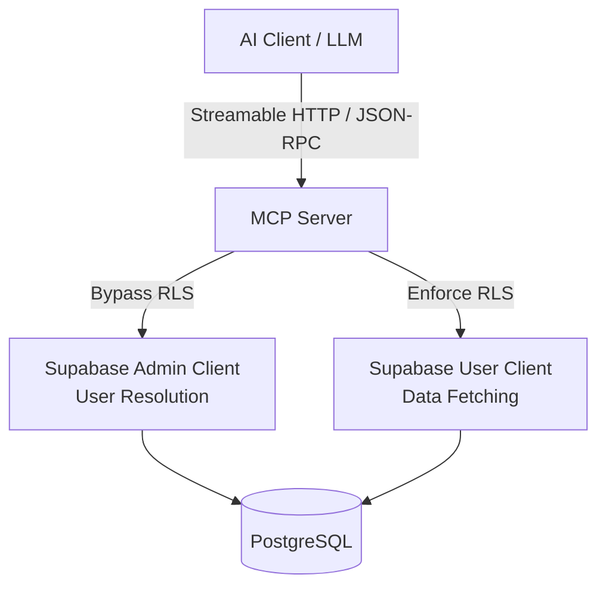

# AcademicFlow MCP Server

This directory contains the Model Context Protocol (MCP) server for CS&BS AcademicFlow. It acts as an agentic gateway, allowing AI clients (like ChatGPT, Claude, and OpenClaw) to securely access and reason over verified academic data.

## Architecture

The MCP Server sits between AI clients and the AcademicFlow Supabase backend:



1. **Authentication:** AI clients connect to the MCP server with a `Bearer` token. This token must be a valid Supabase JWT for the user.
2. **User Identity:** The MCP server resolves the user identity server-side. **Tool arguments are NEVER used for identity.**
3. **Authorization:** Queries to fetch data use a Supabase client scoped to the authenticated user's JWT. This ensures the MCP server strictly respects the existing Row-Level Security (RLS) policies.
4. **Agentic Design:** The tools provide structured academic data. All GPA calculations are deterministic (performed identically to the frontend). The AI agent reasons over this data but does not recalculate official metrics.

## Installation

```bash
npm install
```

## Environment Variables

Copy the `.env.example` file to `.env`:

```bash
cp .env.example .env
```

You need the following variables:

```ini
MCP_PORT=3001
MCP_BASE_URL=http://localhost:3001

# Find these in your Supabase project settings
SUPABASE_URL=your_supabase_url
SUPABASE_PUBLISHABLE_KEY=your_publishable_key

# SERVER-SIDE ONLY: Required to look up users from access tokens
SUPABASE_SERVICE_ROLE_KEY=your_service_role_key
```

**Security Warning:** Never expose the `SUPABASE_SERVICE_ROLE_KEY` to the frontend or any client-side code.

## Running Locally

Run the MCP server in development mode (with auto-reload):

```bash
npm run dev
```

Run in production mode:
```bash
npm run build
npm start
```

## Available Endpoints

*   **Health:** `GET http://localhost:3001/health`
    Returns a simple JSON status to verify the service is running.
*   **MCP:** `POST http://localhost:3001/mcp`
    The streamable HTTP endpoint for MCP clients. Requires an `Authorization: Bearer <token>` header.

## Available Tools (Phase 1: Read-Only)

All tools operate strictly on the currently authenticated user's data.

*   `get_my_profile`: Returns user profile data (name, register no, batch, etc.).
*   `get_my_academic_records`: Returns semester records and verification status.
*   `get_my_subject_performance`: Returns subject-wise performance across all semesters.
*   `get_my_gpa_history`: Returns deterministic SGPA and CGPA history.
*   `get_my_attendance`: Returns attendance records.
*   `get_my_achievements`: Returns recorded achievements.
*   `search_my_documents`: Searches document metadata (never exposes private storage URLs).
*   `get_my_academic_insights`: A composite snapshot tool designed for AI reasoning.

## Security Considerations

1.  **No Tool-Based Identity:** The AI cannot ask for another student's ID via arguments like `{"student_id": "123"}`. Identity is strictly bound to the JWT.
2.  **RLS Enforcement:** Data fetches use the user's JWT, falling back to Supabase's database-level security.
3.  **Read-Only Scope:** Phase 1 tools only allow reading data. There are no tools to modify marks or request verification.
4.  **No AI Hallucination for Official Data:** The `get_my_gpa_history` and `get_my_academic_insights` tools use the exact same deterministic calculation logic as the frontend. The AI interprets the output; it does not calculate the official GPA.

## MCP Inspector Testing

You can test the MCP server tools locally using the official MCP Inspector.

1. Ensure your server is running (`npm run dev`).
2. In a separate terminal, run:

```bash
npx @modelcontextprotocol/inspector --url http://localhost:3001/mcp
```
*(Currently the inspector has limited support for testing remote HTTP servers with custom headers like Bearer tokens. You may need to create a test token or temporarily disable auth to test with the standard inspector).*

## Production Deployment

The server is built with Express and is ready to be deployed as a standard Node.js service (e.g., to Render, Heroku, or an AWS EC2 instance).

1. Ensure Node.js 20+ is installed.
2. Run `npm install --production` (or equivalent).
3. Run `npm run build`.
4. Ensure all environment variables are set in your hosting platform.
5. Run `npm start`.

*Note: Ensure you use HTTPS in production so that Bearer tokens are not transmitted in plaintext.*

## Future Work (OAuth & OpenClaw)

This server currently accepts Supabase access tokens. To connect ChatGPT or Claude directly, you will need to implement a full OAuth 2.0 flow:

1.  The AI Client directs the user to an AcademicFlow authorization page.
2.  The user logs into AcademicFlow and grants read permissions to the AI Client.
3.  AcademicFlow issues an OAuth Access Token.
4.  The AI Client uses this token to communicate with this MCP Server.
5.  This server validates the token and maps it to the Supabase User ID.

Currently, this flow is bypassed by expecting a direct Supabase JWT for testing and integration.
